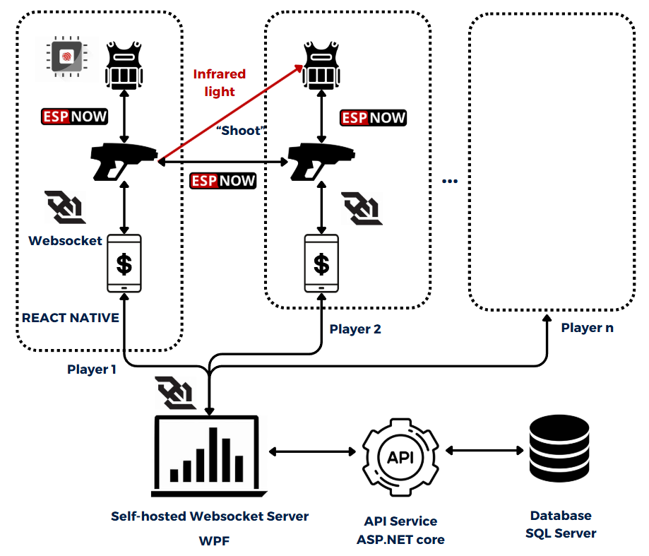

---

# Advanced Laser Tag System

Welcome to the Advanced Laser Tag System! This project combines cutting-edge technologies to create an interactive laser tag game with real-time features. Our system is designed for entertainment, leveraging mobile and desktop applications, WebSocket communication, IoT integration, and more.

## Project Overview

The Advanced Laser Tag System includes:

- **Multiple Players**: Players can join the same game, hosted by a centralized machine.
- **Real-Time Gameplay**: Players can tag (shoot) each other using laser guns and receive instant feedback.
- **Upgrade System**: Players earn credits from successful tags and can purchase upgrades for their equipment.
- **Desktop Management**: A WPF-based desktop application tracks player data in real-time.
- **Mobile Integration**: Players can manage their profiles and game states via a React Native mobile app.

## Features

1. **Real-Time Gameplay**: Players can interact and compete with minimal latency.
2. **Mobile App**: 
   - Manage player profiles.
   - Track game stats and states.
   - Available in the [TekConnect](https://github.com/dunglq3110/TekConnect.git) repository.
3. **Desktop App**:
   - Real-time game monitoring and control.
   - Built with WPF.
   - Available in the [TekHub](https://github.com/dunglq3110/TekHub.git) repository.
4. **WebSocket Server**: Facilitates communication between devices.
5. **IoT Integration**: Embedded programming for ESP32 microcontrollers to handle laser tag guns.
6. **Upgrade System**: Players can enhance their laser guns using credits earned during gameplay.
7. **SQL Server Database**: Robust backend for managing game data.

## System Architecture

Our system uses a modular architecture with clear divisions:

- **WebSocket Protocol**: Powers real-time communication.
- **Desktop and Mobile Apps**: Allow seamless interaction with the game environment.
- **IoT Devices**: Laser guns and tagging equipment built using ESP32 microcontrollers.
- **API Server**: Built with ASP.NET Core to handle data exchanges.

To see a full explanation of the code and system architecture, check out this [YouTube video](https://youtu.be/HZiLD_5nmoo).

## Demo

Watch a full demo of the system and its features here: [System Demo on YouTube](https://youtu.be/ieiwZ6Z7xVg)
---

Feel free to adapt this further or let me know if you'd like to tweak anything!
